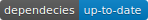

        

        

# Dragonball
A repository dedicated to issue tracking for [Dragonball](https://dragonball.biturl.io "Dragonball")

#FAQ:
  If you have any question/concern, please contact us at admin@biturl.io
  
#License:
  MIT
